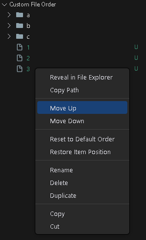
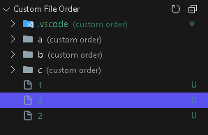

# Custom File Order

Take control of your file explorer! This lightweight VS Code extension allows you to manually reorder files and folders to suit your workflow.

Make your important files stand out by moving them to the top, regardless of their alphabetical order.

## Features

- **Manual Ordering**: Right-click any file or folder in the "Custom File Order" view and move it Up or Down.
- **Smart Sorting**: Keeps your projects organized exactly how you want them.
- **Reset & Restore**:
  - **Restore Item Position**: Reset a single file to its default alphabetical position within your custom list.
  - **Reset to Default Order**: Clear all custom ordering for a folder to revert to standard VS Code sorting.
- **Folder Rules**: Global "Folders First" support to match your VS Code settings.

## Usage

1. **Open the View**: Look for the **"Custom File Order"** activity bar item or view in Explorer.
2. **Reorder**:
   - Right-click any item and select **"Move Up"** or **"Move Down"**.
   - The folder will automatically switch to "Custom Order" mode.
3. **Resetting**:
   - To fix a single item: Right-click -> **"Restore Item Position"**.
   - To clear a whole folder: Right-click -> **"Reset to Default Order"**.

## Usage Showcase

## License

This project is open source and available under the [MIT License](./LICENSE).