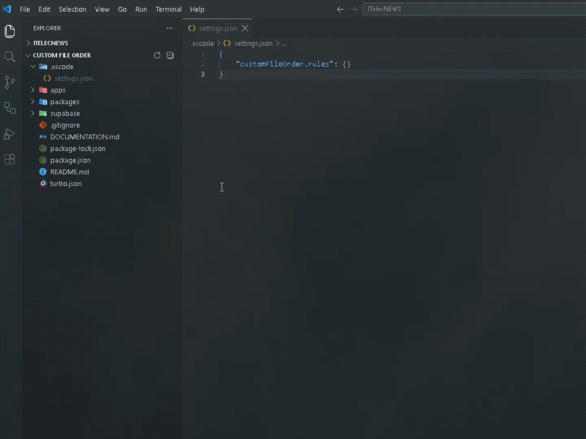

# Custom File Order

Take control of your file explorer! This lightweight VS Code extension allows you to manually reorder files and folders to suit your workflow.

Make your important files stand out by moving them to the top, regardless of their alphabetical order.



## Features

- **Manual Ordering**: Move any file or folder Up or Down, from the context menu or with
  `Shift+Alt+Up` / `Shift+Alt+Down`.
- **Multi-Select Moves**: Select several items and they move together as a block, keeping their
  relative order.
- **Smart Sorting**: Keeps your projects organized exactly how you want them, with digit-aware
  names so `file2` sorts before `file10`.
- **Reset & Restore**:
  - **Restore Item Position**: Reset a single file to its default alphabetical position within your custom list.
  - **Reset to Default Order**: Clear all custom ordering for a folder to revert to standard VS Code sorting.
- **Folder Rules**: Global "Folders First" support to match your VS Code settings.
- **Familiar Context Menu**: New File, New Folder, Open to the Side, Reveal in File Explorer,
  Open in Integrated Terminal, Cut/Copy/Paste, Copy Path, Copy Relative Path, Rename, Duplicate
  and Delete — on both files and folders, like the built-in Explorer.

## Usage

1. **Open the View**: Look for the **"Custom File Order"** view in the Explorer sidebar.
2. **Reorder**:
   - Press `Shift+Alt+Up` / `Shift+Alt+Down`, or right-click any item and select
     **"Move Up"** or **"Move Down"**.
   - Select several items first and they move together as a block, keeping their relative
     order. Only items in the same folder move against each other.
   - The folder will automatically switch to "Custom Order" mode.
3. **Resetting**:
   - To fix a single item: Right-click -> **"Restore Item Position"**.
   - To clear a whole folder: Right-click -> **"Reset to Default Order"**.

## Keyboard Shortcuts

These apply while the **Custom File Order** view has focus. Plain arrow keys navigate as usual.

| Shortcut | Action |
| --- | --- |
| `Shift+Alt+Up` / `Shift+Alt+Down` | Move the selected item(s) up or down |
| `F2` | Rename |
| `Delete` | Delete |
| `Ctrl+X` / `Ctrl+C` / `Ctrl+V` | Cut / Copy / Paste |

Cut and paste performs a move, so nothing is copied and deleted behind your back. Paste only
appears once something has been cut or copied.

### Acting on the workspace root

VS Code does not let extensions add a menu to the blank area below a view's items
([microsoft/vscode#188259](https://github.com/microsoft/vscode/issues/188259)), so right-clicking
empty space cannot work the way it does in the built-in Explorer. The same actions live in the
view's toolbar instead: **New File** and **New Folder** are icons in the view header, and
**Open in Integrated Terminal** and **Paste** are in its `...` menu. All four act on the
workspace root.

## Configuration

Ordering is stored in your workspace settings under `customFileOrder.rules`. Each key is a
folder path relative to the workspace root (using `/`), or `.` for the root itself. Entries
can be exact names or globs, and anything you do not list is appended in the default order.

```json
{
  "customFileOrder.rules": {
    ".": { "order": ["package.json", "README.md", "src"] },
    "src/components": { "order": ["index.ts", "*.tsx", "*.css"] }
  }
}
```

| Setting | Default | Description |
| --- | --- | --- |
| `customFileOrder.defaultFoldersFirst` | `true` | Show folders before files where no custom order applies. |
| `customFileOrder.showCustomOrderIndicator` | `true` | Label folders that carry their own ordering rule. |
| `customFileOrder.enableAutoRefresh` | `true` | Refresh the view when files are created or deleted. |

## License

This project is open source and available under the [MIT License](./LICENSE).